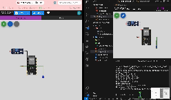

# ESP32 IoT Web Controller

ESP32가 직접 제공하는 웹 화면에서 두 개의 LED를 원격 제어하는 임베디드 웹 프로젝트입니다. 별도의 서버 없이 마이크로컨트롤러가 HTTP 요청을 처리하며, Wokwi 시뮬레이터에서 동작을 확인할 수 있습니다.



## 주요 기능

- ESP32 기반 HTTP 서버 구동
- 웹 UI를 통한 LED 2개 개별 제어
- PlatformIO 기반 빌드 환경
- Wokwi를 이용한 하드웨어 시뮬레이션

## 기술 스택

- ESP32
- C++ / Arduino framework
- PlatformIO
- HTML
- Wokwi

## 실행 방법

1. PlatformIO를 설치합니다.
2. 프로젝트를 빌드합니다.

```bash
pio run
```

3. VS Code 명령 팔레트에서 `Wokwi: Start Simulator`를 실행합니다.
4. 시뮬레이션이 시작되면 `http://localhost:8180`에서 제어 화면을 엽니다.

## 배운 점

- 제한된 임베디드 환경에서 HTTP 요청을 처리하는 방법
- 웹 입력을 GPIO 제어로 연결하는 구조
- 실제 하드웨어 배포 전 시뮬레이터를 활용한 검증 과정
